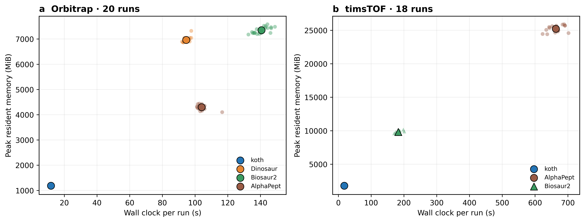
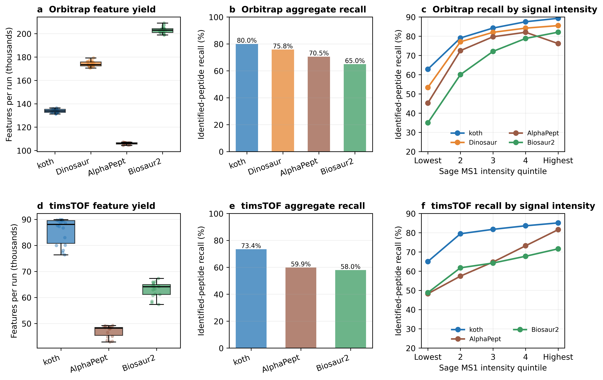

# Benchmark evidence

These figures come from the koth feature-detection manuscript in preparation.
They were measured with koth 0.7.0, commit
`88f9e7c54c9ad3d6ca5a56a906703a3d46982f43`, not with the current release.
Later releases change the timsTOF mobility scale (0.10.0 reports
Bruker-calibrated 1/K0; the manuscript evaluation applies the same calibration
through an adapter), the Thermo reader, and `koth_align` defaults.
The primary cohorts contain 20 IonStar Orbitrap runs and 18 timsTOF runs.
Comparator tools have their own recorded versions and tuned configurations;
these results describe the tested datasets and settings, not every workload.

## Runtime and memory

Lower is better on both axes. Small points represent runs; outlined points
represent tool means. Measurements use the same otherwise idle workstation.
The manuscript reports elapsed time and peak resident memory per run; this
comparison does not measure concurrent throughput.

## Identified-peptide recall

Recall measures coverage of peptide observations independently identified by
Sage, after charge, mass, retention-time, and (for timsTOF) calibrated mobility
matching. It is not sensitivity over all true MS1 features. The figure shows raw
recall. Because some matches occur by chance, the manuscript also reports a
chance rate (the same join at a decoy mass offset) and compares finders on net
recall, raw minus chance. In the timsTOF three-isotope control, koth and
AlphaPept have similar raw recall and koth has fewer chance matches.

This copy of the figure predates the manuscript's current recall join (Sage
`calcmass` with a per-run ppm offset). Replace it from the finalized manuscript
before citing its values.

On independent UPS2 and Orbitrap Astral validation sets, koth and Dinosaur have
similar identified-peptide recall. Changing matching windows or isotope
requirements narrows or eliminates some differences; no finder is uniformly
superior across all criteria. These are per-run feature-detection results,
not validation of `koth_align` confidence calibration.

## Reproducibility

The [manuscript repository](https://github.com/pgarrett-scripps/koth-paper) holds
methods, raw-data accessions, comparator versions, and analysis scripts. It may
remain private during manuscript preparation. The relevant configurations are
in `analysis/config/`, including `koth_ff.toml` and `koth_ff_bruker.toml`;
`analysis/koth.lock` records the detector pin. Use the configurations associated
with the manuscript snapshot rather than assuming the tool defaults reproduce
these figures.

[Figure provenance](assets/provenance.json) records the manuscript checkout,
source filenames, generator names, and SHA-256 hashes. The figures were copied
from the manuscript working tree; that tree contains uncommitted work, so the
recorded HEAD alone is not a complete reproducibility snapshot. Finalize and
commit the manuscript sources before describing these as a frozen publication.
The copies here make the images available without depending on access to the
manuscript repository.
